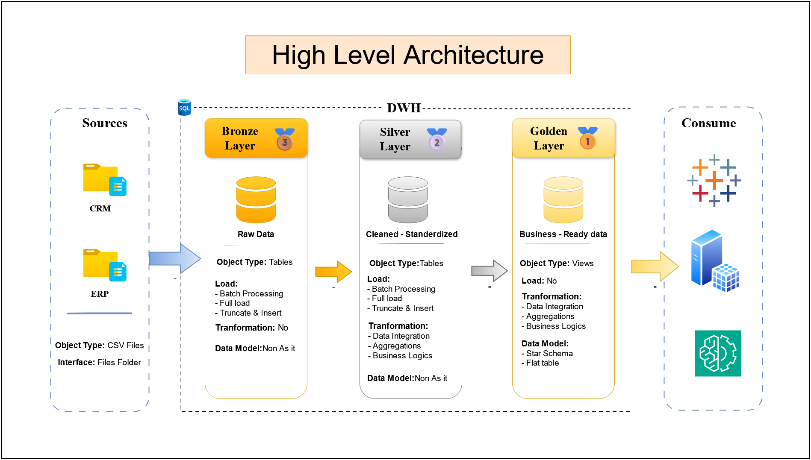
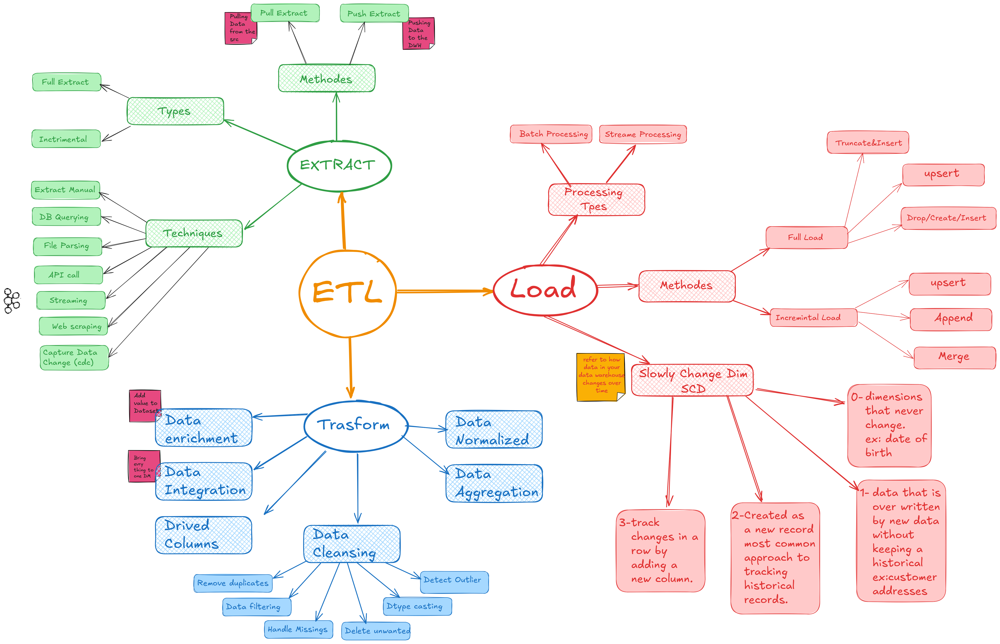
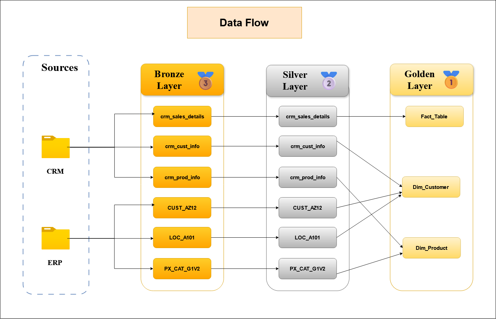
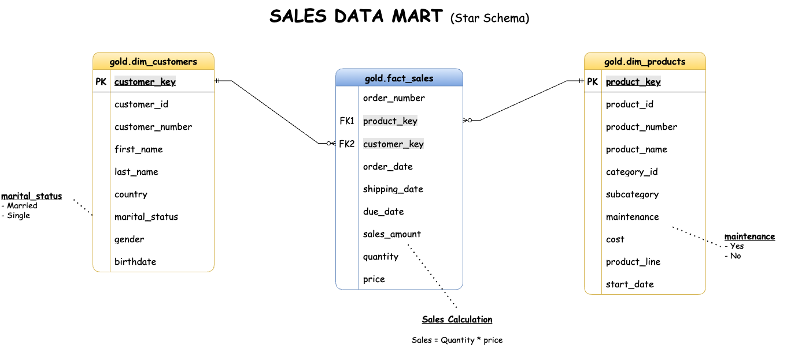

# Data Warehouse and Analytics Project

Welcome to the **Data Warehouse and Analytics Project** repository! 🚀  
This project demonstrates a comprehensive data warehousing and analytics solution, from building a data warehouse to generating actionable insights. Designed as a portfolio project, it highlights industry best practices in data engineering and analytics.

---
## 🏗️ Data Architecture

The data architecture for this project follows Medallion Architecture **Bronze**, **Silver**, and **Gold** layers:


1. **Bronze Layer**: Stores raw data as-is from the source systems. Data is ingested from CSV Files into SQL Server Database.
2. **Silver Layer**: This layer includes data cleansing, standardization, and normalization processes to prepare data for analysis.
3. **Gold Layer**: Houses business-ready data modeled into a star schema required for reporting and analytics.

---
## 📖 Project Overview

This project involves:

1. **Data Architecture**: Designing a Modern Data Warehouse Using Medallion Architecture **Bronze**, **Silver**, and **Gold** layers.
2. **ETL Pipelines**: Extracting, transforming, and loading data from source systems into the warehouse.
3. **Data Modeling**: Developing fact and dimension tables optimized for analytical queries.
4. **Analytics & Reporting**: Creating SQL-based reports and dashboards for actionable insights.

🎯 This repository is an excellent resource for professionals and students looking to showcase expertise in:
- SQL Development
- Data Architect
- Data Engineering  
- ETL Pipeline Developer  
- Data Modeling  
- Data Analytics  

---

## 🚀 Project Requirements

### Building the Data Warehouse (Data Engineering)

#### Objective
Develop a modern data warehouse using SQL Server to consolidate sales data, enabling analytical reporting and informed decision-making.

#### Specifications
- **Data Sources**: Import data from two source systems (ERP and CRM) provided as CSV files.
- **Data Quality**: Cleanse and resolve data quality issues prior to analysis.
- **Integration**: Combine both sources into a single, user-friendly data model designed for analytical queries.
- **Scope**: Focus on the latest dataset only; historization of data is not required.
- **Documentation**: Provide clear documentation of the data model to support both business stakeholders and analytics teams.

---

### BI: Analytics & Reporting (Data Analysis)

#### Objective
Develop SQL-based analytics to deliver detailed insights into:
- **Customer Behavior**
- **Product Performance**
- **Sales Trends**

These insights empower stakeholders with key business metrics, enabling strategic decision-making.  

For more details, refer to [docs/requirements.md](docs/requirements.md).

## 📂 Repository Structure
```
SQL_DWH_Project/
│
├── Datasets/                           # Raw datasets used for the project (ERP and CRM data)
├── Docs/                               # Project documentation and architecture details
│   ├── etl.drawio                      # Draw.io file shows all different techniquies and methods of ETL
│   ├── high_level_arch.png                 # Draw.io file shows the project's architecture
│   ├── data_catalog.md                 # Catalog of datasets, including field descriptions and metadata
│   ├── data_flow.png                   #  file for the data flow diagram
│   ├── data_model.png                  # file for data models (star schema)
│   ├── naming-conventions.md           # Consistent naming guidelines for tables, columns, and files
│
├── Script/                            # SQL scripts for ETL and transformations
│   ├── Bronze/                         # Scripts for extracting and loading raw data
│   ├── Silver/                         # Scripts for cleaning and transforming data
│   ├── Gold/                           # Scripts for creating analytical models
│
├── Test/                              # Test scripts and quality files
│
├── README.md                           # Project overview and instructions
├── LICENSE                             # License information for the repository
└── 
```
---
## ⚙️ How to Run This Project

1. **Clone the Repository**

   ```bash
   git clone https://github.com/mustafarezk12/SQL_DWH_Project.git
   cd SQL-Data-Warehouse
2. **Set Up SQL Server Environment**
* Install SQL Server Express and Azure Data Studio (if not already installed).

# 📊 ETL (Extract, Transform, Load) Process

**ETL** is a key process in data engineering used to move data from multiple sources, transform it into a structured format, and load it into a data warehouse or data lake for analytics and reporting.

---

## 📌 What is ETL?

ETL stands for:

- **Extract** – Collect data from different sources (e.g., databases, APIs, flat files).
- **Transform** – Clean, enrich, and convert raw data into meaningful format.
- **Load** – Insert the transformed data into the target system (data warehouse, lake, etc.).

---

## 🧩 ETL Process Steps

### 🔹 1. Extract
- **Goal**: Pull raw data from source systems.
- **Sources**: APIs, databases, CSV/JSON files, web scraping, streaming platforms.
- **Techniques**: 
  - Manual extract
  - SQL queries
  - API calls
  - File parsing
  - Change Data Capture (CDC)
- **Types**:
  - *Full Extract* – Load everything each time.
  - *Incremental Extract* – Load only new or changed data.

---

### 🔸 2. Transform
- **Goal**: Convert raw data into meaningful and usable formats.
- **Tasks**:
  - Data cleansing (remove duplicates, handle missing values)
  - Data integration from multiple sources
  - Data normalization
  - Data aggregation
  - Derived columns and enrichment

---

### 🔺 3. Load
- **Goal**: Write the transformed data to the target destination.
- **Types**:
  - *Full Load* – Replace entire dataset.
  - *Incremental Load* – Update or append only changed data.
- **Processing**:
  - *Batch Processing* – Periodic/scheduled loads.
  - *Stream Processing* – Real-time data ingestion.

---

## 🧠 Slowly Changing Dimensions (SCD)

Used to manage changes in dimension data over time:

| Type | Description |
|------|-------------|
| **Type 0** | Data never changes (e.g., date of birth) |
| **Type 1** | Overwrites old data (no history kept) |
| **Type 2** | Creates new records to preserve history |
| **Type 3** | Tracks limited history using additional columns |

---

## 📌 ETL Process Diagram

> Visual representation of the entire ETL process:



---

3. **Run ETL Scripts**
* Run `Scripts/DB_creationt.sql` to initialize the database and schemas.
* Load ERP and CRM CSV files into Bronze layer tables using scripts in `Scripts/Bronze/`.
* Transform and clean the data using scripts in `Scripts/Silver/`.
* Execute the script in `Scripts/Gold/` to generate business-ready data for analytics and reporting.
  


4. **Explore Data**
* Use the star schema in the Gold layer for analytical queries and reporting.
  


---

## 🧪 Testing & Validation
* Data quality checks scripts in the tests/ folder ensure:
  * Data consistency, accuracy, and standardization by checking for:
    - Null or duplicate primary keys.
    - Unwanted spaces in string fields.
    - Data standardization and consistency.
    - Invalid date ranges and orders.
    - Data consistency between related fields.
  * Uniqueness of surrogate keys in dimension tables.
  * Referential integrity between fact and dimension tables.
  * Validation of relationships in the data model for analytical purposes.

---
 
## 🔮 Future Work
This project lays the foundation for a robust and scalable data warehouse. Future enhancements could include:

* 📊 SQL-Based Analytics
  
  Develop advanced SQL queries to extract business insights such as:
  * Customer segmentation
  * Sales trends
  * Product performance
  * Revenue by country
    
* 📈 Integration with BI Tools
  
  Connect the Gold layer to Business Intelligence tools like:
  * Power BI
  * Tableau
  * Metabase
    
  ...to create interactive dashboards and self-service analytics for stakeholders.

* 🛠️ Automation & Scheduling

  Use SQL Server Agent or external orchestration tools (e.g., Airflow, Azure Data Factory) to automate ETL pipelines and data refreshes.

* 🔐 Role-Based Access Control (RBAC)

  Enforce security policies and access levels depending on user roles (data analyst, data engineer, etc.)

* 📦 Data Export APIs

  Build export mechanisms for downstream systems and data consumers.

---


## 🛡️ License

This project is licensed under the [MIT License](LICENSE). You are free to use, modify, and share this project with proper attribution.

